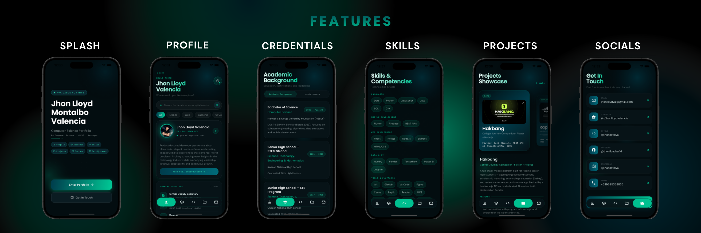
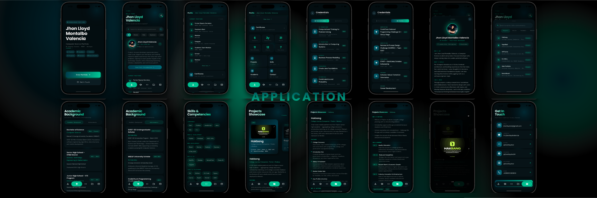

<div align="center">


# Lloyd Interactive Portfolio

**A Polished, Multi-Platform Personal Portfolio Built with Flutter**

[](https://flutter.dev)
[](https://dart.dev)
[](https://flutter.dev)
[](#)
[](#)

*A modern, interactive digital portfolio that showcases identity, projects, skills, and achievements with dynamic theming and fluid animations.*

</div>

---

## Table of Contents

1. [Overview](#overview)
2. [What is Lloyd Portfolio?](#what-is-lloyd-portfolio)
3. [Core Features](#core-features)
4. [App Flow & Architecture](#app-flow--architecture)
5. [Tech Stack](#tech-stack)
6. [Dependencies](#dependencies)
7. [State Management](#state-management)
8. [Data Models](#data-models)
9. [Project Structure](#project-structure)
10. [Design System](#design-system)
11. [Theme Palette](#theme-palette)
12. [Getting Started](#getting-started)
13. [Development](#development)
14. [Deployment](#deployment)
15. [Roadmap](#roadmap)

---

## Overview

<div align="center">
    
</div>

Lloyd Interactive Portfolio is a production-ready personal portfolio application built with Flutter. It serves as a digital showcase for professional identity, project work, technical skills, academic background, certifications, and contact information.

**Why a Flutter portfolio?**

- **Write Once, Run Everywhere** — Single codebase for Web, iOS, Android, macOS, Linux, and Windows
- **Premium UI/UX** — Smooth animations, custom theming, and responsive design
- **Self-Hosted Control** — Complete ownership of personal brand and data
- **Modern Web Presence** — Stand out from static portfolios with dynamic interactions
- **Career Impact** — Demonstrates full-stack mobile and frontend expertise

---

## What is Lloyd Portfolio?

<div align="center">
    
</div>

Lloyd Portfolio is a Flutter application designed to present a professional identity and body of work in a visually engaging, interactive format. The app provides:

- A **visual identity card** with profile info, positions, and quick statistics
- A **comprehensive project gallery** with carousel navigation and detailed project info
- A **skills showcase** organized by technology category
- An **academic background hub** with education history and competitions
- A **credentials page** showcasing certificates, events, seminars, and workshops
- A **contact bridge** linking social profiles and messaging channels
- A **5-palette dynamic theme switcher** with persistent local storage
- **Ambient animations** that respond to theme color changes

---

## Core Features

<div align="center">
    
</div>

### 1. **Profile Section**
- Clean identity card displaying name, title/position, and professional headline
- Quick stat display: projects completed, years of experience, clients/organizations
- Avatar/hero image with professional photo
- Positioned roles/titles with organization names
- Bio snippet with call-to-action
- One-tap access to full introduction sheet

### 2. **Projects Showcase**
- **Pseudo-infinite carousel** with smooth swipe navigation
- **Synced detail panel** that updates as carousel rotates
- Project metadata: title, description, tech stack tags, link to live demo/repo, role
- Featured project highlights
- Search and filter capabilities (optional)
- Category organization (Web, Mobile, Open Source, etc.)

### 3. **Skills Gallery**
- Technology tags organized by category (Frontend, Backend, DevOps, Mobile, etc.)
- Color-coded skill categories
- Proficiency indicators (optional)
- Skill endorsements or usage frequency
- Search-as-you-type filtering

### 4. **Academic & Competitions**
- **Segmented view** with two tabs:
  - **Academic:** Degree(s), university(ies), graduation date, honors/GPA, relevant coursework
  - **Competitions:** Hackathons, coding contests, case competitions with awards/placements
- Timeline view or grid layout
- Detailed expanded cards with achievement descriptions

### 5. **Credentials Hub**
- **Two-tab interface:**
  - **Certificates:** Professional certs, course completions, licensures (Coursera, Google, AWS, etc.)
  - **Events:** Seminars, webinars, conferences, workshops attended
- Card layout with issuer logo, date, and credentials link
- Sortable by date or category

### 6. **Contact & Social Bridge**
- Direct links to email, phone, messaging apps (Telegram, WhatsApp, Discord, etc.)
- Social profile links (GitHub, LinkedIn, Twitter, Portfolio website, etc.)
- Contact form or call-to-action button
- QR code for vCard / contact details (optional)

### 7. **Dynamic Theme System**
- **20 built-in color palettes:**
  - **Default:** Teal (`#00C996`)
  - **Ember:** Amber-Gold (`#F0CB35`)
  - **Orchid:** Purple (`#AD5389`)
  - **Storm:** Silver (`#BDC3C7`)
  - **Citrine:** Lime (`#F1F2B5`)
  - **Aurora:** Cyan (`#22D3EE`)
  - **Rose:** Pink-Red (`#FB7185`)
  - **Ocean:** Blue (`#3B82F6`)
  - **Verdant:** Emerald (`#10B981`)
  - **Lavender:** Violet (`#A78BFA`)
  - **Blush:** Warm Pink (`#EF629F`)
  - **Meadow:** Sky Blue (`#64B3F4`)
  - **Coral:** Peach (`#FFA17F`)
  - **Slate:** Steel Blue (`#3A6073`)
  - **Parchment:** Cream (`#E5E5BE`)
  - **Crimson:** Deep Red (`#E65758`)
  - **Neon:** Electric Green-Cyan (`#00FF87`)
  - **Citrus:** Orange-Yellow (`#FF930F`)
  - **Candy:** Indigo-Lilac (`#696EFF`)
  - **Mono:** Greyscale (`#A3A3A3`)
- **Live theme switching** via inline popover picker
- **Persistent theme selection** saved to device
- **Ambient background animations** that morph color in response to theme
- **Smooth transitions** between themes with no page reload

### 8. **Animated Onboarding**
- First-launch 3–5 slide introduction flow
- Brand storytelling with auto-advance option
- Seamless transition to main portfolio view
- Skip button for returning users

### 9. **Floating Navigation Bar**
- **5-tab bottom navigation** with animated active indicator
- Smooth fade/slide transitions between sections
- Icon-based navigation for quick access
- Mobile-optimized spacing and touch targets

### 10. **Responsive & Cross-Platform**
- Adapts beautifully to phone, tablet, desktop, and web viewports
- Touch-optimized on mobile, mouse/keyboard-friendly on desktop
- Native feel on each platform (Material on Android/Web, Cupertino on iOS options)
- Fluid layouts using MediaQuery and responsive widgets

---

## App Flow & Architecture

```
App Launch
│
├── main.dart
│     ├── Load theme preference from shared_preferences
│     ├── Initialize ValueNotifiers (themeIndex, navigationBarIndex)
│     └── runApp(MyApp)
│
├── app.dart (MaterialApp)
│     ├── ValueListenableBuilder(themeIndex)
│     │     └── Dynamically apply current theme
│     └── Scaffold root
│           └── MainPage
│
├── Onboarding Check
│     ├── First launch? → OnboardingPage
│     │     ├── Slide 1: Welcome
│     │     ├── Slide 2: Projects
│     │     ├── Slide 3: Skills
│     │     ├── Slide 4: Experience
│     │     └── Slide 5: Call to Action
│     │           └── [Continue] → MainPage
│     └── Returning user? → MainPage
│
└── MainPage (IndexedStack + Floating NavBar — 5 tabs)
      ├── Tab 0 — Profile    : Identity card, intro sheet, theme picker
      ├── Tab 1 — Projects   : Carousel + detail sync panel
      ├── Tab 2 — Skills     : Category tags with search
      ├── Tab 3 — Academic   : Education & competitions (segmented)
      └── Tab 4 — Credentials: Certificates & Events (tabbed)
      │
      └── Atmosphere Layer   : Animated background blobs (theme-responsive)

Detail Pages:
├── IntroductionSheet       : Full hero bio, extended about, quick links
├── CredentialsPage         : Segmented Certificates + Events
├── ProjectDetailPage       : Full project info with gallery/video
└── ContactPage             : Social links and contact form
```

---

## Tech Stack

| Layer | Technology |
|---|---|
| **Framework** | Flutter `^3.11.4` |
| **Language** | Dart `^3.11.4` |
| **State Management** | `ValueNotifier` + `ValueListenableBuilder` (zero external state library) |
| **Persistence** | `shared_preferences ^2.3.3` |
| **Typography** | `google_fonts` (DM Sans, Poppins, DM Mono) |
| **UI/UX** | Built-in Flutter widgets (Material, Cupertino) |
| **Icons** | `font_awesome_flutter`, Material Icons |
| **Animations** | Flutter's `animation` package + custom Tweens |
| **Navigation** | Named routes via `MaterialApp.routes` or Navigator 2.0 |
| **Image Handling** | `cached_network_image` (optional), `image` package |
| **Responsive Layout** | `MediaQuery`, `LayoutBuilder`, custom responsive widgets |
| **URL Launching** | `url_launcher` (for links, social, contact) |
| **Platforms Supported** | iOS, Android, macOS, Linux, Windows, Web |

---

## Dependencies

### Runtime Dependencies

```yaml
# UI & Typography
google_fonts: ^6.0.0
font_awesome_flutter: ^10.0.0

# State & Persistence
shared_preferences: ^2.3.3

# URL & Linking
url_launcher: ^6.3.2

# Optional: Image caching
cached_network_image: ^3.3.0

# Optional: Advanced animations
lottie: ^3.3.2

# Optional: Social sharing
share_link: ^0.3.0
```

### Dev Dependencies

```yaml
flutter_lints: ^6.0.0
```

---

## State Management

Lloyd Portfolio uses a lightweight, dependency-free state management built entirely on Flutter's built-in `ValueNotifier` and `ValueListenableBuilder`. All shared state lives in `lib/notifiers.dart`.

### Global Notifiers

| Notifier | Type | Purpose |
|---|---|---|
| `navigationBarIndex` | `ValueNotifier<int>` | Current bottom nav tab (0–4) |
| `themeIndex` | `ValueNotifier<int>` | Currently selected theme palette (0–4) |

### Theme Persistence

When `themeIndex` changes, the new index is immediately saved to device via `shared_preferences.setInt()`. On app launch, the saved theme is restored in `main.dart` before `runApp()` is called.

```dart
// Example flow
themeIndex.value = 2;  // User selects "Orchid"
await prefs.setInt('themeIndex', 2);  // Persist
// On restart: themeIndex is initialized to 2
```

---

## Data Models

All models are plain Dart classes located in `lib/features/home/models/`. No ORM is used — data is managed in memory.

### `Portfolio`
```
name, title, headline, bio, avatar (URL/asset),
positions (List<Position>)
stats (List<Stat>)
```

### `Position`
```
title, organization, startDate, endDate, isCurrent, description, skills (List<String>)
```

### `Project`
```
id, title, description, shortDescription, 
imageUrl, coverImageUrl,
technologies (List<String>),
role, link (URL to live site),
repositoryUrl, featured (bool),
category (String)
```

### `Skill`
```
name, category, proficiency (0-100), color, icon
```

### `Academic`
```
degree, institution, graduationDate, gpa, honors,
relevantCoursework (List<String>)
```

### `Competition`
```
name, type, date, placement, award, description
```

### `Credential`
```
title, issuer, issueDate, expirationDate (nullable), 
credentialUrl, credentialImage, category ("Certificate" | "Event")
```

### `Contact`
```
type ("email" | "phone" | "social"), label, url/value
```

### `Theme Palette`
```
name, primaryColor, accentColor, 
backgroundColor, surfaceColor,
textColor, secondaryTextColor
```

---

## Project Structure

```
lib/
├── main.dart                        # Entry point — theme init
├── app.dart                         # MaterialApp root with theme listener
├── notifiers.dart                   # Global ValueNotifiers
│
├── core/
│   ├── constants/
│   │   ├── app_colors.dart          # Mutable color palette
│   │   ├── app_strings.dart         # Localized strings (optional)
│   │   └── theme_palettes.dart      # 5 preset themes
│   │
│   ├── theme/
│   │   ├── app_theme.dart           # ThemeData builders for each palette
│   │   ├── font_styles.dart         # Typography scale (heading, body, mono)
│   │   └── theme_utils.dart         # Helper functions for theme updates
│   │
│   └── widgets/                     # Shared/base widgets
│       ├── responsive_scaffold.dart # Responsive layout wrapper
│       └── atmosphere_background.dart  # Animated blob background
│
├── features/
│   │
│   ├── onboarding/
│   │   ├── presentation/
│   │   │   └── onboarding_page.dart  # 5-slide intro PageView
│   │   └── widgets/
│   │       ├── onboarding_slide_1.dart
│   │       ├── onboarding_slide_2.dart
│   │       └── ... (slides 3–5)
│   │
│   └── home/
│       ├── models/                  # Data classes
│       │   ├── portfolio.dart
│       │   ├── project.dart
│       │   ├── skill.dart
│       │   ├── academic.dart
│       │   ├── credential.dart
│       │   └── contact.dart
│       │
│       ├── presentation/
│       │   ├── main_page.dart       # Root shell (IndexedStack + nav)
│       │   ├── project_detail_page.dart
│       │   └── contact_page.dart
│       │
│       └── widgets/
│           ├── profile_section.dart       # Identity card + stats
│           ├── intro_sheet.dart           # Full bio bottom sheet
│           ├── projects_section.dart      # Carousel + detail
│           ├── skills_section.dart        # Tag grid
│           ├── academic_section.dart      # Education + competitions
│           ├── credentials_section.dart   # Certs + events
│           ├── contact_section.dart       # Links + form
│           ├── floating_nav_bar.dart      # Bottom nav
│           ├── theme_switcher.dart        # Color palette picker
│           └── atmosphere_layer.dart      # Background animation
│
└── data/                            # Static data / mock data
    ├── projects.dart
    ├── skills.dart
    ├── academic.dart
    ├── credentials.dart
    └── contact_info.dart
```

---

## Design System

Lloyd Portfolio uses a fully custom, centralized design system with a **dark theme** as the foundation. All design tokens are defined in `lib/core/` and shared across the entire app — no inline colors or font sizes.

### Color Palette

The app comes with **5 swappable color palettes**, each with a distinct personality:

| Palette | Primary | Accent | Mood |
|---|---|---|---|
| **Default** (Teal) | `#00C996` | `#00E5B4` | Fresh, modern, tech-forward |
| **Ember** (Amber-Red) | `#F0CB35` | `#FFA500` | Warm, energetic, creative |
| **Orchid** (Purple) | `#AD5389` | `#E890C8` | Elegant, artistic, sophisticated |
| **Storm** (Slate) | `#BDC3C7` | `#95A5A6` | Professional, minimalist, corporate |
| **Citrine** (Lime) | `#F1F2B5` | `#FFFF66` | Bold, playful, optimistic |

### Typography

| Token | Font | Use Case |
|---|---|---|
| `displayLarge` | DM Sans, 48px, Bold | Page headlines |
| `headlineSmall` | Poppins, 24px, SemiBold | Section titles |
| `bodyLarge` | Poppins, 16px, Regular | Body text |
| `bodySmall` | Poppins, 14px, Regular | Secondary info |
| `labelMedium` | DM Mono, 12px, Regular | Tags, badges, metadata |

### Spacing & Layout

- **Padding tokens:** `p4`, `p8`, `p12`, `p16`, `p24` (multiples of 4dp)
- **Border radius:** `4dp` (sharp), `8dp` (standard), `16dp` (rounded), `24dp` (very rounded)
- **Shadows:** Elevated 1dp (subtle), 4dp (card), 8dp (dialog)

### Animations

- **Theme transition:** 300ms ease-in-out
- **Page fade:** 200ms ease-in
- **Carousel scroll:** Custom spring physics
- **Atmosphere blobs:** 6–8 second infinite loop

---

## Getting Started

### Prerequisites

- Flutter SDK `>=3.11.4` — [Install Flutter](https://docs.flutter.dev/get-started/install)
- Dart SDK `>=3.11.4` (bundled with Flutter)
- A connected device, simulator, or web browser

### Installation

```bash
# 1. Clone the repository
git clone https://github.com/jhonlloydval/lloyd-interactive-portfolio.git
cd lloyd-interactive-portfolio

# 2. Install dependencies
flutter pub get

# 3. Run the app
flutter run

# Or run on a specific platform
flutter run -d chrome          # Web
flutter run -d <device_id>    # iOS/Android device
```

### Web Deployment

```bash
# Build for web
flutter build web

# Deploy to Firebase Hosting, Netlify, Vercel, or GitHub Pages
# (See Deployment section below)
```

### iOS Setup

```bash
cd ios
pod install
cd ..
flutter run
```

### Android Setup

No additional native setup required beyond standard Flutter configuration.

---

## Development

### Running in Debug Mode

```bash
flutter run -v  # Verbose output
```

### Hot Reload

```bash
r   # Hot reload (code changes)
R   # Full restart (model/asset changes)
```

### Building Locally

```bash
# Android APK
flutter build apk

# iOS app
flutter build ios

# Web
flutter build web

# macOS
flutter build macos

# Linux
flutter build linux

# Windows
flutter build windows
```

### Code Style

- Follow [Effective Dart](https://dart.dev/guides/language/effective-dart)
- Run `dart format` before committing
- Use meaningful variable/function names
- Keep functions under 50 lines when possible

---

## Deployment

### Web (Firebase Hosting)

```bash
# 1. Build web bundle
flutter build web --release

# 2. Initialize Firebase (if not already done)
firebase init hosting

# 3. Deploy
firebase deploy --only hosting
```

Your portfolio will be live at `https://<project>.web.app`

### Web (GitHub Pages)

```bash
# 1. Build web with base path
flutter build web --base-href=/lloyd-interactive-portfolio/

# 2. Deploy (assuming you have gh-pages branch)
# Copy build/web/* to gh-pages branch and push
```

Live at: `https://jhonlloydval.github.io/lloyd-interactive-portfolio/`

### Mobile (Google Play / App Store)

#### Android (Google Play)

```bash
# 1. Create a signed release APK
flutter build appbundle --release

# 2. Upload to Google Play Console
# (See Flutter docs for detailed steps)
```

#### iOS (App Store)

```bash
# 1. Build iOS app
flutter build ios --release

# 2. Upload via Xcode or TestFlight
# (See Flutter docs for detailed steps)
```

### Desktop Apps

```bash
# macOS
flutter build macos --release

# Linux (snap package)
flutter build linux --release

# Windows
flutter build windows --release
```

---

## Roadmap

| Feature | Status | Priority |
|---|---|---|
| Core portfolio sections (profile, projects, skills, academic, credentials) | ✅ Live | — |
| 5-palette theme switcher | ✅ Live | — |
| Theme persistence (shared_preferences) | ✅ Live | — |
| Animated onboarding flow | ✅ Live | — |
| Floating navigation bar | ✅ Live | — |
| Responsive layout (mobile, tablet, web, desktop) | ✅ Live | — |
| Ambient background animations | ✅ Live | — |
| Full introduction bottom sheet | ✅ Live | — |
| Social links & contact bridge | ✅ Live | — |
| Web deployment (Firebase / GitHub Pages) | ✅ Live | — |
| Mobile deployment (iOS / Android) | 🔜 Next | High |
| Desktop apps (macOS, Windows, Linux) | 🔜 Next | Medium |
| Blog section with articles | 🔜 Planned | Medium |
| Dark mode toggle (separate from theme) | 🔜 Planned | Low |
| Internationalization (i18n) — EN, ES, TL | 🔜 Planned | Low |
| Form submissions (backend integration) | 🔜 Planned | Medium |
| Analytics (Firebase Analytics) | 🔜 Planned | Low |
| PWA features (installable web app) | 🔜 Planned | Low |
| Project filtering & search | 🔜 Planned | Low |
| Resume download link | 🔜 Planned | Low |
| GitHub integration (live project fetching) | 🔜 Planned | Low |

---

## Contributing

This is a personal portfolio project. Pull requests and suggestions are welcome! Please:

1. Fork the repository
2. Create a feature branch (`git checkout -b feature/amazing-feature`)
3. Commit your changes (`git commit -m 'Add amazing feature'`)
4. Push to the branch (`git push origin feature/amazing-feature`)
5. Open a Pull Request

---

## License

This project is licensed under the **MIT License** — see the [LICENSE](LICENSE) file for details.

You are free to fork, modify, and use this as a template for your own portfolio.

---

## Contact

**Lloyd** — [@jhonlloydval](https://github.com/jhonlloydval)

- **GitHub:** [github.com/jhonlloydval](https://github.com/jhonlloydval)
- **Email:** [jhonlloydval@gmail.com](mailto:jhonlloydval@gmail.com)
- **Portfolio:** [lloyd-portfolio.web.app](https://lloyd-portfolio.web.app)

---

<div align="center">

Built with ❤️ using Flutter.

*Lloyd Interactive Portfolio — My whole journey in a single tap.*

</div>
